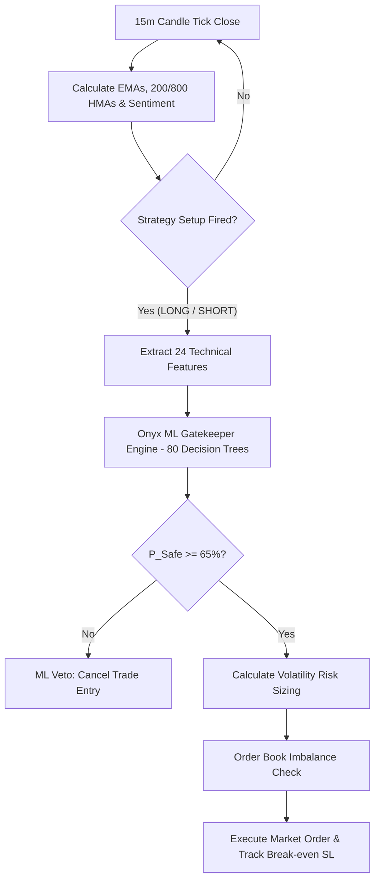

# Onyx Trading Bot

Onyx is a quantitative futures trading system designed for Binance USDⓈ-M perpetual contracts (BTC, ETH, SOL, BNB, and LINK) operating on a 15-minute timeframe.

The bot combines a deterministic trend-following strategy with a machine learning classification filter to gate trade entries. The ML classifier evaluates 24 normalized technical and market state indicators before order dispatch to reduce hard loss drawdown.

---

## System Execution Flow



---

## Strategy & Risk Architecture

### 1. Trend & Entry Conditions
* **Macro Baseline**: Uses a 200 HMA (Hull Moving Average) baseline to identify trend direction. Long entries are evaluated only above the 200 HMA; short entries only below it.
* **Trigger (EMA Pullback)**: Monitors 9 EMA and 21 EMA spreads. Long triggers require 9 EMA > 21 EMA with a Heikin-Ashi candle low dipping below 9 EMA before closing back above it. Short triggers require 9 EMA < 21 EMA with a high spiking above 9 EMA before closing below it.
* **Predicta Sentiment Filter**: Computes bullish and bearish pressure scores. Setup triggers are skipped unless sentiment passes symbol-specific gates.
* **Order Book Liquidity Guard**: Checks top-3 bid/ask volume imbalance immediately before order submission to prevent market orders into thin liquidity.

### 2. Risk Management
* **Dynamic Sizing**: Capital exposure is fixed at 1.5% of total account value per trade. Position sizing is dynamically computed from entry to Stop Loss distance.
* **Stop Loss (SL)**: Positioned at the 3-candle High Volume Node (HVN) with a 1.5x ATR cushion.
* **Take Profit (TP)**: Set to a 1.5x Risk-to-Reward ratio, scaling to 2.0x or 2.5x when Predicta sentiment indicates strong momentum.
* **Break-even SL Locking**: When an open trade reaches +1.0x R:R profit, the Stop Loss automatically moves to entry price.

---

## Machine Learning Gatekeeper

The ML filter is implemented as a pure NumPy vectorized binned decision forest (`data/onyx_ml_gatekeeper.json`) optimized for low-memory execution (< 15MB RAM footprint).

### Dataset & Training
* **Dataset Size**: 26,783 trade setups extracted from 3 years of 15m Binance Futures OHLCV data.
* **Forward Simulation**: Features are labeled against dynamic +1.0R break-even trailing SL outcomes (Hard Loss = 0, Breakeven = 1, Clean Win = 2).
* **Threshold**: Requires P(Safe) = P(Breakeven) + P(Clean Win) >= 65% to approve trade entry.

### 5-Fold Purged & Embargoed Cross-Validation
To eliminate time-series data leakage and temporal autocorrelation, the classifier was evaluated across 5 chronological folds with a 5-day (480-candle) embargo buffer between train and validation windows.

| Fold | Validation Window | Train Set Rows | Baseline Safe % | ML Safe Precision | Expectancy Delta |
|---|---|---|---|---|---|
| Fold 1 | 0 to 5,356 | 20,947 | 52.58% | 53.09% | +0.016 R |
| Fold 2 | 5,356 to 10,712 | 20,467 | 52.00% | 52.96% | +0.021 R |
| Fold 3 | 10,712 to 16,068 | 20,467 | 52.93% | 54.62% | +0.043 R |
| Fold 4 | 16,068 to 21,424 | 20,467 | 51.29% | 51.66% | +0.003 R |
| Fold 5 | 21,424 to 26,783 | 20,944 | 50.64% | 51.57% | +0.024 R |
| **Mean** | **All Folds** | **20,658** | **51.89%** | **52.78%** | **+0.021 R / trade** |

### Top Predictor Features
1. `vol_ratio` (7.05% weight) - Volume surge relative to 20 SMA
2. `hma800_dist_pct` (5.97% weight) - Distance from 800 HMA macro trendline
3. `atr_squeeze_ratio` (5.93% weight) - Volatility compression ratio (14 ATR / 100 ATR)
4. `ha_body_to_range_ratio` (5.88% weight) - Heikin-Ashi candle body momentum
5. `hma200_slope_pct` (5.30% weight) - 200 HMA trend slope angle

---

## Live Dashboard

The web interface runs locally at `http://localhost:8000`:

* **Telemetry HUD**: Displays real-time P(Win), P(BE), P(Loss) probabilities, combined safety score, and ML filter state (Approved / Dry-Run Veto / Veto).
* **Capital Metrics**: Displays total balance, portfolio value, open PnL, win rate, and saved risk capital.
* **Feature Drivers**: Displays live indicator values for volume ratio, ATR squeeze ratio, and ADX momentum.
* **Audit Feed**: Displays a rolling log of trade evaluations with timestamps, symbols, setup directions, and ML scores.

---

## Command Reference

### Run Bot
```bash
python3 main.py          # Live market mode
python3 main.py --sim    # Offline accelerated simulation mode
```

### ML Utility Scripts
```bash
python3 scripts/harvest_ml_dataset.py       # Harvest 3-year OHLCV dataset
python3 scripts/train_ml_model.py          # Train binned ensemble model
python3 scripts/prune_features.py          # Run feature importance ranking
python3 scripts/purged_cross_validation.py # Run 5-fold purged & embargoed CV
python3 scripts/reset_account.py           # Reset capital and clear trade ledgers
```

### Configuration (`config.py`)
```python
USE_ML_GATEKEEPER = True        # Enable ML classifier filter
ML_DRY_RUN = False              # False: Actively block trades; True: Log dry-run vetoes
ML_CONFIDENCE_THRESHOLD = 0.65  # Minimum Safe probability score
```

---

*Disclaimer: For research and educational purposes only. Test thoroughly in simulation mode before trading live capital.*
