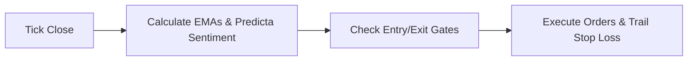

# Onyx Trading Bot

A systematic pullback breakout bot built for USDⓈ-M futures trading on Binance. Designed to run on a 15-minute timeframe, it scans BTC, ETH, SOL, BNB, and LINK to execute trend-following trades under tight, volatility-based risk parameters.

It features a local stochastic market simulator (pure Gaussian random walk) for offline sandbox testing, and a real-time WebSocket dashboard interface to monitor active metrics.

---

## How it works

The execution flow is straightforward:



### The Strategy
*   **Trend Filter**: The bot uses a 200 HMA (Hull Moving Average) baseline to identify macro direction. It only takes longs when the price is above the HMA 200, and shorts when below it.
*   **Trigger (The EMA Pullback)**: It watches the 9 and 21 EMAs. For a buy trigger, the EMA 9 must be above the EMA 21, and the Heikin Ashi candle low must dip below the EMA 9 before closing back above it. For a sell trigger, the high must spike above the EMA 9 before closing below it.
*   **Sentiment Gates**: Incorporates our custom "Predicta V4" sentiment engine. Signals are ignored unless buying/selling pressure is strong enough to pass the asset's specific gate (e.g. 55% for ETH, 52% for BTC).
*   **Liquidity Guard**: Evaluates the order book bid/ask volume imbalance immediately before executing a market order to prevent entering during thin liquidity slippage.

### Risk Controls
*   **Dynamic Sizing**: Risk is limited to 1.5% of total capital per trade. The bot dynamically computes your contract sizing by measuring the distance between the entry price and stop loss. Wide stops automatically reduce position size; tight stops increase it.
*   **Stop Loss (SL)**: Anchored to the structural High Volume Node (HVN) of the last 3 candles, plus a 1.5x ATR buffer for breathing room.
*   **Take Profit (TP)**: Placed at a 1.5x Risk-to-Reward ratio, scaling up to 2.5x if the Predicta Sentiment indicates strong continuation.
*   **Break-even Trail**: Once a trade reaches 1.0x R:R in profit, the stop loss is automatically moved to your entry price to secure a risk-free trade.

---

## Getting Started

### Installation
First, clone the files and install the dependencies:
```bash
git clone https://github.com/Sharif-z/onyx-TradingBot.git
cd onyx-TradingBot
pip install -r requirements.txt
```

### Configuration
Open `config.py` to change parameters like leverage, session filters, and custom sentiment entry gates.

### Running the Bot

**1. Simulation Mode (Offline Sandbox)**
Generates fully random Gaussian price action to test the code offline. It boots fresh with a clean $10,000 balance every time:
```bash
python3 main.py --sim
```

**2. Live Mode**
Executes real trading setups. Make sure you run a VPN set to a Binance-supported region if you are accessing from a geoblocked country:
```bash
python3 main.py
```

### Telemetry Dashboard
Open **`http://localhost:8000`** in your browser to load the glassmorphism dark-themed dashboard.
It shows synchronized Heikin Ashi and standard charts with live 9 EMA (green) and 21 EMA (red) line plots, markers, balance metrics, and active position telemetry.

---
*Disclaimer: Use at your own risk. Backtest and simulate thoroughly before using real money.*
