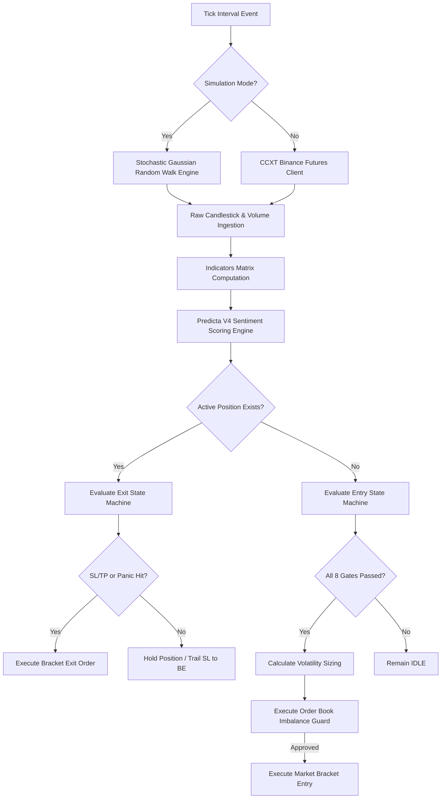

# 🔮 Onyx Quant Desk

[](#)
[](#)
[](#)
[](#)

Onyx Quant Desk is a premium, high-frequency quantitative trading framework built for USDⓈ-M futures trading on Binance. Operating on a **15-minute timeframe**, it executes a systematic, algorithmic pullback strategy across 5 core high-liquidity assets: **BTC/USDT, ETH/USDT, SOL/USDT, BNB/USDT, and LINK/USDT**.

Features include a local **stochastic Gaussian Random Walk simulator**, dynamic **ATR-based structural position sizing**, **sentiment gates**, and an **HTML5 glassmorphism telemetry dashboard** over WebSockets.

---

## 📐 System Architecture

The following flowchart maps the tick lifecycle from data ingestion to state machine execution:



---

## 📈 The Trading Strategy

Onyx runs a **Heikin Ashi Pullback Breakout** strategy designed to capture trend-continuation movements during active momentum phases:

### 1. Macro Trend Filter
*   **Indicator**: Hull Moving Average (HMA) with a 200-period lookback.
*   **Rule**: Long setups are only evaluated when the price closes above the HMA 200. Short setups are only evaluated when the price closes below the HMA 200.

### 2. Micro Trend Filter
*   **Indicator**: Exponential Moving Averages (EMA 9 and EMA 21).
*   **Rule**: The EMAs must align with the macro trend (EMA 9 > EMA 21 for longs; EMA 9 < EMA 21 for shorts).

### 3. Structural Pullback Trigger (The Core Logic)
*   **Long Entry**: The Heikin Ashi candle low must touch or cross below the fast EMA 9, while its close remains strictly above the EMA 9.
*   **Short Entry**: The Heikin Ashi candle high must touch or cross above the fast EMA 9, while its close remains strictly below the EMA 9.
*   *This filters out chasing breakouts and guarantees entry during minor pullbacks.*

### 4. Sentiment Gate (Predicta V4 Engine)
*   **Indicator**: Predicta V4 Sentiment Index (integrating multi-period RSI, Stochastic oscillators, and volume delta momentum).
*   **Rule**: Bullish/bearish sentiment must exceed custom asset gates (e.g. $\ge 55\%$ for ETH, $\ge 52\%$ for BTC) to shield against whipsaws.

### 5. Order Book Imbalance Guard
*   **Rule**: Prior to execution, the bot evaluates the real-time bid/ask liquidity depth. If the volume depth is heavily skewed against the trade direction, it vetoes the entry.

---

## 🛡️ Risk Management & Sizing

Onyx is designed defensively, prioritizing capital preservation:

### 1. Structural Dynamic Position Sizing
Each trade risk is hardcapped at **1.5% of total account equity**. Contracts are calculated dynamically:
$$\text{Contracts} = \frac{\text{Account Balance} \times 0.015}{\text{Entry Price} - \text{Stop Loss Price}}$$
*Volatility expands or contracts your size, keeping your downside risk constant.*

### 2. Dynamic Structural Stop Loss (SL)
Rather than a fixed percentage, the stop loss is set by looking back at the last 3 candles:
1. Identifies the High Volume Node (HVN) price level.
2. Places the stop loss behind this structural level with a **`1.5x ATR`** cushion.

### 3. Adaptive Take Profit (TP)
*   **Base Target**: 1.5x Risk-to-Reward (R:R) ratio.
*   **Sentiment Booster**: Scales up to 2.5x R:R if Predicta V4 scores indicate extreme high-conviction momentum.

### 4. Auto Break-Even Trailing (BE)
When a trade reaches a profit distance of **1.0x R:R**, the Stop Loss is immediately updated to your **Entry Price**, eliminating downside risk.

---

## ⚙️ Installation & Setup

### Prerequisites
*   Python 3.10 or higher
*   Pip package manager

### 1. Clone & Install Dependencies
```bash
git clone https://github.com/Sharif-z/onyx-TradingBot.git
cd onyx-TradingBot
pip install -r requirements.txt
```

### 2. Configuration
Open `config.py` to set up your preferences:
*   `SIMULATION_MODE`: Set to `True` for offline testing, `False` for live trading.
*   `LEVERAGE`: Futures account leverage.
*   `USE_SESSION_FILTER`: Restrict entries to specific time-of-day session overlaps.
*   `USE_MACRO_TREND_FILTER`: Toggle HMA 200 check.

---

## 🚀 How to Run

### Run in Simulation Mode (Offline Sandbox)
In simulation mode, the bot generates a pure Gaussian random walk chart with realistic volatility wicks. It runs offline, ignores real cash persistence, and restarts fresh with **$10,000.00** every time:
```bash
python3 main.py --sim
```

### Run in Live Mode
Live mode connects to the exchange client, loads historical charts, and runs 24/7.
*(Note: If you are running in a geo-restricted location, you must have your VPN active set to a Binance-supported region).*
```bash
python3 main.py
```

### Accessing the Web Dashboard
Once running, open your web browser and navigate to:
👉 **`http://localhost:8000`**

The dashboard includes:
*   A premium glassmorphism dark-themed UI.
*   **9 EMA (green)** & **21 EMA (red)** overlay lines.
*   Heikin Ashi charts displaying real-time trade signals (markers).
*   Live balance tracking, open position status, and historical ledger cards.

---

## ⚖️ Disclaimer

*This software is for educational purposes only. Crypto trading carries a high level of risk, and you can lose more than your initial deposit. Run in simulation mode extensively before deploying live capital.*
