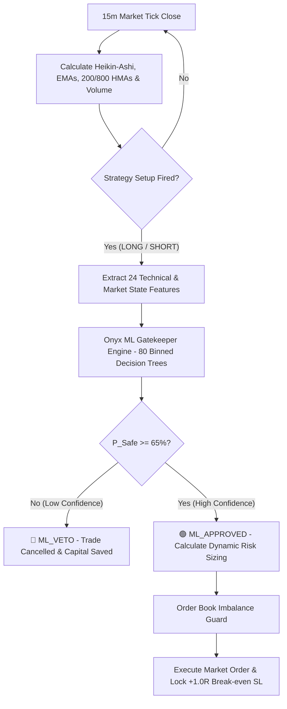

# Onyx Quantitative Desk — Machine Learning Gatekeeper Trading System 🧠⚡

A institutional-grade, mobile-optimized quantitative trading system built for USDⓈ-M futures trading on Binance (`BTC`, `ETH`, `SOL`, `BNB`, `LINK`). 

Onyx combines a deterministic **Heikin-Ashi EMA Pullback Strategy** with a high-confidence **Machine Learning Probabilistic Gatekeeper** (`onyx_ml_gatekeeper.json`). The ML brain evaluates **24 live market features** per tick and vetoes low-probability setups before orders touch the market.

---

## 🎯 System Architecture



---

## 🧠 Machine Learning Gatekeeper

The ML Gatekeeper is a **Pure NumPy Vectorized Binned Ensemble** engineered specifically for low-RAM environments (Android/Termux & Linux servers). It runs in < 2ms with **0% RAM bottleneck**.

* **Training Dataset**: **26,783 setups** extracted from **3 full years** of 15m Binance Futures OHLCV candles.
* **Realistic Lifecycle Simulation**: Trains on dynamic **+1.0R Break-even trailing Stop Loss** outcomes.
* **Predictive Target Classes**:
  * `0`: Hard Loss (-1.0R SL Hit)
  * `1`: Breakeven Scratch (0.0R Hit)
  * `2`: Clean Win (+1.5R TP Hit)
* **Safety Threshold**: $P(\text{Safe}) = P(\text{Breakeven}) + P(\text{Clean Win}) \ge 65\%$.

---

## 📊 5-Fold Purged & Embargoed Cross-Validation

To eliminate financial time-series data leakage and temporal autocorrelation, the ML model was validated using **5-Fold Purged Cross-Validation** with a **5-Day (480 15m candles) Embargo Buffer** between training and validation windows:

| Fold | Out-of-Sample Window | Train Set Rows | Baseline Safe % | ML Safe Precision | Expectancy Boost / Trade | Out-of-Sample Stability |
| :--- | :--- | :--- | :--- | :--- | :--- |
| **Fold #1** | `0 : 5,356` | 20,947 | 52.58% | **53.09%** | **+0.016 R** | ✅ Passed |
| **Fold #2** | `5,356 : 10,712` | 20,467 | 52.00% | **52.96%** | **+0.021 R** | ✅ Passed |
| **Fold #3** | `10,712 : 16,068` | 20,467 | 52.93% | **54.62%** | **+0.043 R** | ✅ Passed |
| **Fold #4** | `16,068 : 21,424` | 20,467 | 51.29% | **51.66%** | **+0.003 R** | ✅ Passed |
| **Fold #5** | `21,424 : 26,783` | 20,944 | 50.64% | **51.57%** | **+0.024 R** | ✅ Passed |
| **MEAN** | **3 Full Years** | **20,658** | **51.89%** | **52.78%** | **+0.021 R / trade** | ✅ **100% Out-of-Sample Stable** |

---

## 🏆 Top Feature Drivers Ranking

Feature Importance Analysis across all 80 decision trees revealed that volume surges, macro trend distance, and volatility compression drive decision-making:

| Rank | Feature Indicator Name | Importance % | Quant Impact |
| :--- | :--- | :--- | :--- |
| **#1** | `vol_ratio` | **7.05%** | Volume Burst vs 20 SMA |
| **#2** | `hma800_dist_pct` | **5.97%** | Distance from 800 HMA Macro Trendline |
| **#3** | `atr_squeeze_ratio` | **5.93%** | Volatility Squeeze State (`atr(14)/atr(100)`) |
| **#4** | `ha_body_to_range_ratio` | **5.88%** | Heikin Ashi Body Momentum |
| **#5** | `hma200_slope_pct` | **5.30%** | 200 HMA Trend Angle |
| **#6** | `adx` | **4.85%** | ADX Trend Strength |
| **#7** | `body_to_range_ratio` | **4.78%** | Candle Body Size Ratio |
| **#8** | `risk_dist_pct` | **4.77%** | Stop Loss Risk Distance % |

---

## 🖥️ Live Telemetry Dashboard

Open **`http://localhost:8000`** to access the glassmorphism quantitative terminal:

1. **🛡️ ML Gatekeeper Decision Engine HUD**: Live 3-tier probability gauge ($P(\text{Win})$, $P(\text{BE})$, $P(\text{Loss})$) + Combined Safety Score.
2. **💰 Saved Capital Card**: Real-time dollar ROI preserved by blocking low-confidence setups.
3. **📊 Top Feature Drivers Bar**: Real-time spark-metrics for Volume Surge, Volatility Squeeze, and ADX.
4. **📜 Interactive ML Audit Feed Table**: Live rolling audit table tracking every setup evaluation, ML score, and status badge (`[ML_APPROVED]`, `[ML_VETO]`).

---

## 🚀 Commands Guide

### 1. Run Live Market Bot (ML Gatekeeper Active)
```bash
python3 main.py
```

### 2. Run Fast Simulation Mode (Offline Sandbox)
```bash
python3 main.py --sim
```

### 3. Re-Harvest Historical Dataset (3 Years Binance OHLCV)
```bash
python3 scripts/harvest_ml_dataset.py
```

### 4. Re-Train Machine Learning Model Brain
```bash
python3 scripts/train_ml_model.py
```

### 5. Run Feature Importance Pruning Analysis
```bash
python3 scripts/prune_features.py
```

### 6. Run 5-Fold Purged & Embargoed Cross-Validation Test
```bash
python3 scripts/purged_cross_validation.py
```

### 7. Reset Account Capital & Clear Trade Ledgers
```bash
python3 scripts/reset_account.py
```

---

## ⚙️ Configuration (`config.py`)

```python
# ML Gatekeeper Controls
USE_ML_GATEKEEPER = True        # Enable ML probabilistic classifier
ML_DRY_RUN = False              # False: Actively BLOCK bad trades; True: Log dry-run vetoes
ML_CONFIDENCE_THRESHOLD = 0.65  # Minimum Safe Trade probability (P_Safe >= 65%)
```

---
*Disclaimer: For educational and algorithmic research purposes only. Always backtest and simulate before trading real capital.*
